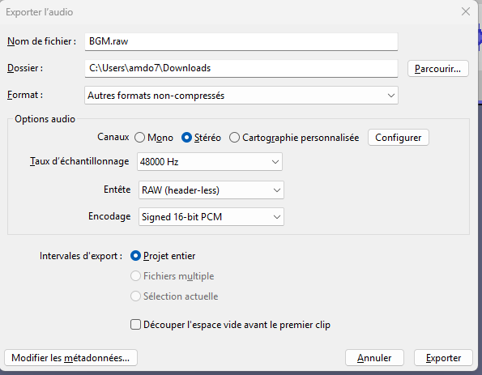

# RVLoader-LMV

> A fork of [RVLoader](https://github.com/Aurelio92/RVLoader) adding animated splash screens and multi-theme UI support — each theme brings its own look, music, and sound effects inspired by iconic Nintendo interfaces.

[](https://www.gnu.org/licenses/gpl-3.0)
[](https://github.com/Aurelio92/RVLoader)
[]()

---

##  What's new in LMV

| Feature | Description |
|---|---|
| 🎬 Animated splash screen | Per-theme intro animation plays on boot |
| 🎨 Theme system | Switch between Wii, Wii U, DSi and 3DS styles |
| 🎵 Background music | Each theme has its own looping background track |
| 🔊 Sound effects | Navigation, launch and cancel sounds per theme |
| 🔧 Same core | All original RVLoader features are preserved |

---

## 🎨 Available themes

###  Wii
Classic Wii System Menu look — channel grid, bubbly icons, soft blue tones.

###  Wii U
GamePad-inspired layout with flat design, dark background and smooth transitions.

###  DSi
Faithful recreation of the Nintendo DSi Menu — bouncy bubble icons, pastel sky gradient and DSi-style sound effects.

###  3DS
Home Menu style with a dark starfield, hexagonal grid and 3DS UI sounds.

---

## 📁 Theme structure

Themes live in `/rvloader/themes/<theme_name>/` on your SD/USB card.

```
/rvloader/
  themes/
    dsi/
      theme.xml
      scripts/
        background.lua
        gamesview.lua
        bgmusic.lua
        ...
      assets/
        background.png
        icon_frame.png
        ...
    wii/
    wiiu/
    3ds/
  music/
    dsi/  bgmusic.mp3
    wii/  bgmusic.mp3
    wiiu/ bgmusic.mp3
    3ds/  bgmusic.mp3
  sounds/
    dsi/  select.mp3  launch.mp3  back.mp3
    wii/  ...
    wiiu/ ...
    3ds/  ...
```

> **Note:** Music and sound files are **not included** in this repository for copyright reasons.  
> You must supply your own MP3 files and place them in the paths above.

---

## 🚀 Installation

1. Build RVLoader-LMV (see [Build](#build)) or grab a prebuilt release.
2. Copy `driveRoot/` contents to the root of your SD/USB.
3. Add your music/sound files (see structure above).
4. Launch via the Homebrew Channel.

---

## 🔨 Build

### Prerequisites

Install [devkitPro](https://devkitpro.org/wiki/Getting_Started) with the following packages:

```bash
(dkp-)pacman -S wii-dev libfat-ogc ppc-mxml ppc-libpng ppc-freetype ppc-zlib ppc-bzip2
```

### Compile

```bash
git clone https://github.com/Lamondille/RVLoader-LMV
cd RVLoader-LMV
make
```

Clean build artifacts:

```bash
make clean
```

Output: `driveRoot/apps/RVLoader/boot.dol`

---

## 🎵 Background music — required audio format

The BGM system streams raw **PCM** data directly via AESND with zero CPU decoding overhead.  
The file must match these exact parameters:

| Parameter | Value |
|---|---|
| Format | RAW (no header) |
| Encoding | Signed 16-bit PCM |
| Sample rate | 48 000 Hz |
| Channels | Stereo (2 channels) |
| Endianness | Little-endian (Audacity default) |
| File name | `BGM.pcm` |
| Location | `<theme>/assets/audio/BGM.pcm` |

> The little-endian → big-endian byte swap is handled automatically by the loader.

### Using Audacity

1. Open your source audio file (MP3, OGG, WAV…)
2. Set the **project sample rate** to **48000** in the bottom-left corner
3. Keep the track in **stereo** (or use **Tracks → Mix → Mix Stereo Down to Mono** if needed)
4. **File → Export Audio…**
5. Export settings:
   - **Format**: `Other uncompressed files`
   - **Header**: `RAW (header-less)`
   - **Encoding**: `Signed 16-bit PCM`
6. Name the file **`BGM.pcm`**
7. Place it in `/rvloader/themes/<theme_name>/assets/audio/` on your USB drive




### Using ffmpeg (alternative)

```bash
ffmpeg -i source.ogg -f s16le -ar 48000 -ac 2 BGM.pcm
```

> `-f s16le` = Signed 16-bit Little-Endian, `-ac 2` = stereo, `-ar 48000` = 48 kHz

---


## 🤝 Credits
- **[Aurelio92](https://github.com/Aurelio92)** and all RVLoader contributors — original loader, all core functionality
- Theme Lua scripts and splash screen system — RVLoader-Nexus contributors

---

## 📄 License

This project is licensed under the **GNU General Public License v3.0** — see [LICENSE](LICENSE) for details.

This is a fork of [RVLoader](https://github.com/Aurelio92/RVLoader) by Aurelio92, also distributed under GPL-3.0.
